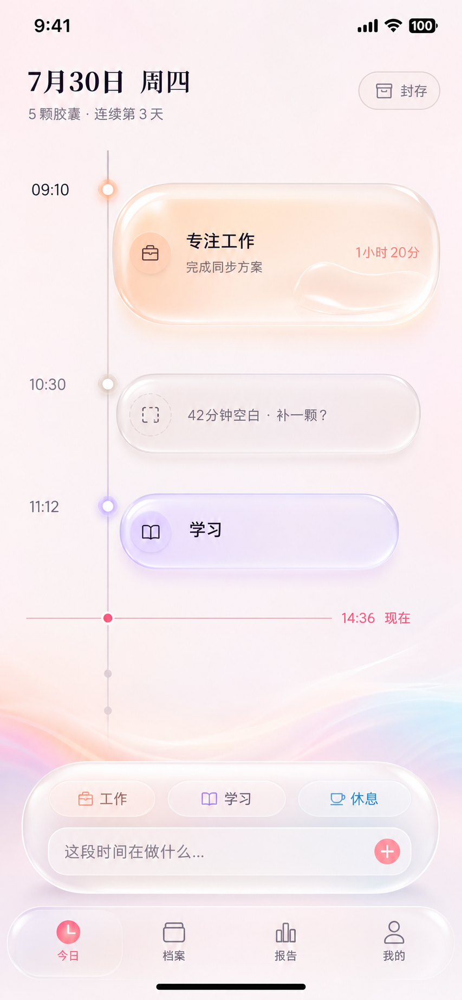
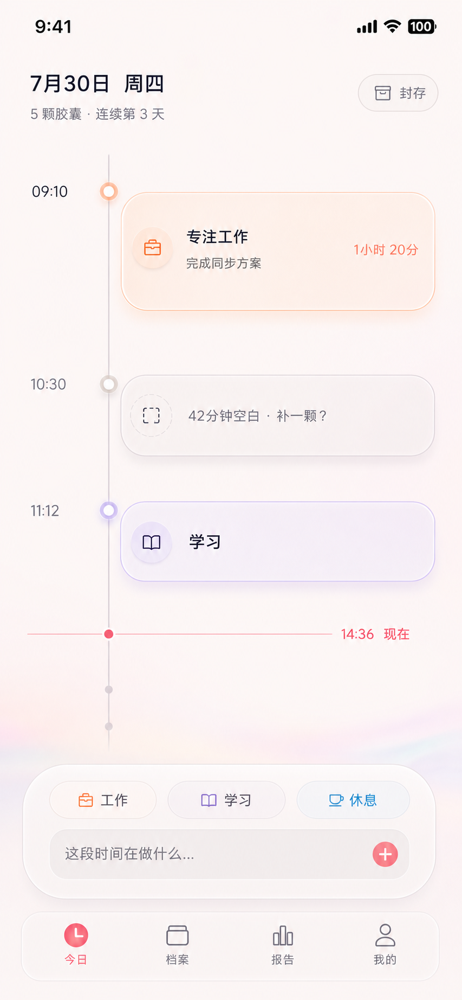

# 06 · UI 设计规范（双主题：时间琥珀默认 / 果冻玻璃可选）

> **决策记录**：
> - 2026-07-27 经四方案比选，定稿 **G · 果冻胶囊 Jelly Glass**；旧版预览存档于 [color-preview.html](color-preview.html) 与 [color-preview-v2.html](color-preview-v2.html)。
> - 2026-07-30 基于 iOS G3 真实界面复审，用户批准升级为双主题体系：**时间琥珀 Chrono Amber 作为默认主题**，**果冻玻璃 Jelly Glass 完整保留为可选主题**。
>
> **裁决规则**：§1–§9 保存果冻玻璃原始规范与全局基础；§10–§17 定义双主题架构、默认时间琥珀和后续开发验收。发生冲突时，**§10–§17 优先**。两套主题共享同一信息架构、业务组件和交互，不复制页面实现。
>
> 写给不懂设计的你：这份文档定义 TickCap 长什么样、为什么长这样，以及两套主题怎样共用一套产品。主题是外观，不改变记录、封存、复盘等业务行为。

## 1. 可选主题原始方向：「果冻胶囊」(Jelly Glass)

> 本节保留 2026-07-27 的完整视觉基因，作为 `jellyGlass` 可选主题依据；默认主题 `chronoAmber` 见 §11。

一句话：**多巴胺的快乐 × 液态玻璃的高级——彩色光晕的天空下，每一刻都是一颗微微发光的果冻胶囊。**

血统来自两支 2025–2026 的顶级设计潮流：
- **Apple Liquid Glass**（苹果 iOS 26 设计语言）：半透明毛玻璃材质、光的折射、悬浮层次——界面控件"浮"在内容之上，靠深度而非线框建立层级
- **多巴胺配色**（Dopamine Design）：高饱和糖果色、强对比、情绪优先——打开它心情就变好

四个气质关键词，所有视觉决策的裁判：

1. **透**——背景是流动的彩色光晕（极光层），卡片是毛玻璃，光穿过内容。界面有空气感，不是一摞不透气的白纸。
2. **弹**——果冻质感：饱满圆角、按压回弹、挂轴时的 Q 弹动画。胶囊是一个想捏一下的"物件"。
3. **甜**——高饱和标签色 + 粉橙渐变的行动色。记录人生的地方应该让人开心。
4. **诚**——数据可视化绝不美化：摸鱼的雾灰胶囊和工作的亮蓝胶囊同样体面地挂在轴上（"诚实的镜子"原则的视觉表达）。

**克制条款（甜而不腻的保险丝）**：玻璃和渐变是「材质」，不是「装饰」——只允许出现在规定的容器上（见 §3.4 材质系统）；正文排版区（复盘阅读、详情长文）一律回归实底高对比，保证长文可读性。苹果自家的 Liquid Glass 都因可读性被 NN/g 点名批评过，我们的玻璃永远垫在足够不透明度之上（规则见 §3.4）。

## 2. 对标研究（我们从谁身上学什么）

| 产品/趋势 | 我们学什么 |
|------|-----------|
| [Structured](https://structured.app/)（垂直时间轴标杆） | 时间轴黄金范式：色块高度与时长成正比、空白清晰可见、一眼看懂一整天 |
| [Day One](https://www.holstee.com/blogs/mindful-matter/best-journaling-apps)（日记天花板） | 回顾的愉悦感、"那年今日"情感钩子、安全感表达 |
| [Daylio](https://radcity.net/best-journaling-apps-2026/)（微记录标杆） | 15 秒完成一条的交互节奏 |
| [Apple Liquid Glass](https://www.theusefulapps.com/news/exploring-apple-liquid-glass-ui-ios26) | 玻璃材质、悬浮式工具栏（我们的滴答栏是一块浮起的玻璃岛）、深度层级；同时吸取 [NN/g 的批评](https://www.nngroup.com/articles/liquid-glass/)：透明度必须为可读性让路 |
| [多巴胺设计](https://www.appsrow.com/glossary/dopamine-design) | 高饱和配色的情绪能量、传播截图的抓眼力 |

## 3. 设计令牌（Design Tokens）

> 小白解释：设计令牌 = 把"用什么颜色、多大字、多圆的角"写成一份全局字典，代码从字典取值。全 App 永远统一，未来小程序/App 用同一本字典（`@tickcap/tokens`）。

### 3.1 色彩 · 基底与文字

| 令牌 | Light | Dark | 用途 |
|------|-------|------|------|
| bg | `#FCF2FA` 粉雾白 | `#150F20` 暮夜紫黑 | 页面基底（其上叠极光层，见 3.2） |
| surface | `#FFFFFF` | `#221A33` | 实底卡片（正文阅读区、弹层内容区） |
| surface-2 | `rgba(255,255,255,.60)` | `rgba(60,45,85,.50)` | 输入框底/次级区块 |
| border | `rgba(200,140,190,.30)` | `rgba(200,150,220,.20)` | 分割线（能不用就不用，优先靠间距分组） |
| text-1 | `#26121F` | `#FBF3FA` | 主文字 |
| text-2 | `#7A5570` | `#C2A8C4` | 次要文字/时间戳 |
| text-3 | `#B58BA8` | `#7E6690` | 占位符/禁用 |

**行动色（primary）与渐变**：

| 令牌 | Light | Dark | 用途 |
|------|-------|------|------|
| primary | `#FF4FA0` 果冻粉 | `#FF6BB0` | 现在线、选中态、链接、强调文字 |
| primary-soft | `rgba(255,79,160,.13)` | `rgba(255,107,176,.16)` | 主色浅底 |
| gradient-action | `linear-gradient(135deg, #FF4FA0, #FF8E3C)` 粉→橙 | 同左 | **只用于三个地方**：滴答按钮（FAB）、封存按钮、选中态标签 chip |

规则：渐变行动色是全 App 最贵的视觉资源，出现即意味着"这是此刻最重要的动作"。**绝不用于装饰、图标、标题**——满屏渐变的 App 很廉价，克制才有仪式感。

### 3.2 色彩 · 极光层（Aurora，品牌记忆点）

页面基底之上、内容之下，铺一层静态的彩色光晕（radial-gradient 组合），这是"果冻胶囊"的天空：

```css
/* Light */
--aurora:
  radial-gradient(circle at 12% 10%, rgba(255,84,163,.22), transparent 45%),
  radial-gradient(circle at 92% 20%, rgba(255,180,60,.22), transparent 45%),
  radial-gradient(circle at 20% 95%, rgba(90,200,250,.22), transparent 50%),
  radial-gradient(circle at 85% 90%, rgba(150,120,255,.18), transparent 45%);
/* Dark */
--aurora-dark:
  radial-gradient(circle at 12% 10%, rgba(255,84,163,.28), transparent 45%),
  radial-gradient(circle at 92% 20%, rgba(255,160,60,.20), transparent 45%),
  radial-gradient(circle at 25% 95%, rgba(90,160,255,.22), transparent 50%);
```

规则：极光层是**静态**的（不做动画，省电省性能）；只在「今日页」「封存流程」「onboarding」「报告封面」出现，列表页/设置页用纯 bg——特别的页面才配特别的天空。

### 3.3 色彩 · 标签色板（12 色，多巴胺档）

胶囊颜色来自主标签。整体比常规 UI 色板提高一档饱和度（多巴胺基因），色条/圆点用标准色，卡片玻璃内叠加该色 11% 着色：

| 标签 | 色 | 标签 | 色 |
|------|-----|------|-----|
| 💼 工作 | `#3D74FF` 电光蓝 | 🗣 社交 | `#FF4D4D` 珊瑚红 |
| 📖 学习 | `#8F52FF` 亮紫 | 🧘 休息 | `#00D4B0` 薄荷 |
| 🏃 运动 | `#17CE55` 荧光绿 | 🌫 摸鱼 | `#8FA3BD` 雾灰蓝（故意低饱和——摸鱼就是这种颜色 😌） |
| 🍜 吃饭 | `#FFA200` 芒果橙 | 💭 发呆/思考 | `#A886FF` 淡雾紫 |
| 🚇 通勤 | `#00A8F0` 天青 | 🛁 生活杂务 | `#D08A2E` 焦糖棕 |
| 😴 睡眠 | `#5A5FFF` 靛蓝 | 🎮 娱乐 | `#C13BFF` 霓虹品紫 |

规则：
- 文字永远不用标签色（可读性差），标签色只出现在色条、圆点、图表
- 社交红/娱乐紫刻意与主色果冻粉拉开色相距离，避免"到处都像按钮"
- Dark 模式标签色再提亮 8–12%（构建时由 tokens 自动生成，不手写两套）

### 3.4 材质系统（本方案的核心，严格执行）

三种材质，各有明确的使用范围，**不允许混用**：

| 材质 | 配方 | 允许出现的地方 |
|------|------|--------------|
| **果冻玻璃 jelly-glass** | Light: `rgba(255,255,255,.55)` + `backdrop-filter: blur(16px) saturate(200%)` + 1px 边 `rgba(255,255,255,.75)` + 内高光 `inset 0 1px 0 rgba(255,255,255,.45)` + 彩色柔影 `0 6px 18px [标签色 18%]`；Dark: 底 `rgba(45,32,70,.5)`、边 `rgba(255,255,255,.14)` | **只有三类容器**：① 胶囊卡 ② 滴答栏玻璃岛 ③ 半屏弹层。玻璃上不叠玻璃（单层规则） |
| **实底 surface** | 纯色 surface + 无模糊 | 正文阅读区（复盘、详情长文）、列表页、设置页——读字的地方拒绝任何透明度游戏 |
| **渐变行动 gradient-action** | 粉→橙 135° | FAB、封存按钮、选中 chip，仅此三处 |

**可读性与性能红线**（玻璃风翻车都在这两处）：
1. 玻璃底不透明度 Light ≥ .55 / Dark ≥ .50，任何情况下玻璃上的 text-1 对比度 ≥ 4.5:1——用工具验证后才准进 tokens
2. `backdrop-filter` 是性能大户：时间轴长列表滚动时，**只有视口内的卡片保留真模糊**；低端设备/不支持 `backdrop-filter` 的浏览器自动降级为 `rgba(255,255,255,.92)` 实底（CSS `@supports` 分支，视觉损失很小）
3. 尊重系统 `prefers-reduced-transparency`：开启时全部玻璃降级为实底

### 3.5 字体

- 字族：系统字体栈 `-apple-system, "PingFang SC", "HarmonyOS Sans", "MiSans", sans-serif`——中文场景系统字体加载最快渲染最好，不引入 webfont（首屏速度 > 个性）
- 时间数字一律 `font-variant-numeric: tabular-nums`（等宽数字，时间轴时刻才能对齐）
- 果冻方案的字重整体上调一档（多巴胺基因）：标题 700、胶囊概括 700、正文 400、chip 600

| 令牌 | 字号/行高 | 字重 | 用途 |
|------|----------|------|------|
| display | 28/36 | 800 | 报告标题、年度数字 |
| title | 20/28 | 700 | 页面标题、日期 |
| body-lg | 17/26 | 700(概括)/400(正文) | 胶囊概括、复盘正文 |
| body | 15/22 | 400 | 常规正文、详情 |
| caption | 13/18 | 400 | 时间戳、时长、辅助说明 |
| micro | 11/14 | 600 | 标签 chip 文字、角标 |

### 3.6 间距 / 圆角

- **间距**：4pt 网格（4/8/12/16/20/24/32）。页面左右安全边距 20；卡片内边距 16；靠间距分组，少用分割线
- **圆角**：胶囊卡 20；滴答栏玻璃岛 24；半屏弹层顶部 28；按钮与 chip 全圆（pill）；输入框 14。大圆角 = 果冻感的一半来源

### 3.7 动效

| 令牌 | 值 | 用途 |
|------|-----|------|
| fast | 150ms / ease-out | chip 选中、hover |
| press | 120ms / spring | **果冻按压**：所有可点元素按下 scale(.96)，松手轻微回弹——"弹"的全局手感 |
| base | 250ms / ease-out | 弹层、卡片展开 |
| slow | 450ms / spring(回弹稍大) | 胶囊挂轴、封存下沉 |

关键动效清单（产品灵魂，逐个打磨）：
1. **胶囊入轴**：滴答后新胶囊从滴答栏"Q 弹"飞到时间轴对应位置，落点轻微 jelly 抖动 + 挂钩圆点涟漪一圈——记录的即时满足感
2. **现在线呼吸**：当前时刻线的圆点 3s 周期呼吸（透明度 0.4↔1 + 微缩放）——"时间正在流动"
3. **封存仪式**：进入深色极光场景 → 时间轴 2s 快速回放 → 整条轴收拢聚合成一颗大果冻胶囊（表面有高光流过）→ 带重量感下沉入档案馆 + streak 数字弹跳 +1。全程可跳过
4. 遵循 `prefers-reduced-motion`：全部降级为淡入淡出（无障碍红线）

## 4. 核心界面图纸（移动端 375pt 基准）

### 4.1 今日页（首页，产品的脸面）

```
┌─────────────────────────────┐ ← 底层：bg + 极光层（静态彩色光晕）
│  ‹  7月26日 周六     [🌙封存] │ ← 顶栏：封存按钮=渐变行动色胶囊钮
│     已滴答 8 次 · 连续 12 天   │ ← caption 弱化
├─ ─ ─ ─ ─ ─ ─ ─ ─ ─ ─ ─ ─ ─ ┤
│ 07:00 ●━ ☀️ 起床              │
│       │                     │
│ 08:00 ●━╔══════════════╗    │ ← 胶囊卡=果冻玻璃：blur+白边+
│       │ ║🚇 通勤  1h    ║    │    内高光+标签色柔影
│       │ ║地铁上看完那篇… ≡║    │    左缘4px高饱和标签色条
│       │ ╚══════════════╝    │    高度∝时长(min 44, max 120)
│ 09:00 🙂━╔═════════════╗    │ ← 挂钩圆点被心情emoji替换
│       │ ║💼 写Q3方案 2h ║    │
│       │ ╚═════════════╝    │
│ 11:00 ┄┄┄ 1.5h 空白 ┄┄┄     │ ← 空隙：虚线（非玻璃），长按补记
│       │                     │
│ 14:32 ━━━━━●━━━━━━━━━━━     │ ← 现在线：果冻粉，圆点呼吸
│                             │
│ ╔═════════════════════════╗ │ ← 滴答栏=悬浮玻璃岛（不贴边，
│ ║[💼工作][📖学习][🍜饭][🌫鱼]║ │    四周留8pt，圆角24，浮在
│ ║ ┌──────────────────┐(●) ║ │    时间轴之上）
│ ║ │ 这段时间在做什么…   │渐变 ║ │ ← FAB 44pt 粉橙渐变+彩影
│ ╚═════════════════════════╝ │
└─────────────────────────────┘
```

要点：
- 滴答栏是**悬浮玻璃岛**（Liquid Glass 的悬浮工具栏范式），常驻底部拇指区——3 秒原则的物理保障。点标签直接完成记录，输入框是可选加料
- 点输入框 → 玻璃岛展开为半屏玻璃弹层：全部标签网格、心情五连 emoji、时间微调条、详情长文框（长文区内部是实底白，保证输入可读）。**展开是渐进增强，收起是默认**
- 时间刻度只标整点（caption/text-3）——刻度是背景，胶囊才是主角
- 空状态：轴中央一颗虚线描边的空胶囊 +"滴答一下，装进今天的第一颗胶囊"

### 4.2 胶囊详情（半屏玻璃弹层）

顶部 28 圆角、可下拉关闭：标签行（可改）→ 一句话概括（body-lg 可编辑）→ 时间区间（双滚轮，步进 15/5 分钟）→ 心情五连 → 详情长文（**实底输入区**，轻 Markdown）→ 底部操作行（⭐高光 / 🔒敏感 / 删除）。**所有编辑即时保存，没有"保存"按钮**——手账不需要提交。

### 4.3 封存流程（三幕仪式）

1. **回放**：全屏深色极光场景，当日时间轴自动从早滚到晚（2s，可跳过），顶部"这是你的 7 月 26 日"
2. **复盘**：AI 复盘流式逐字生成（SSE），分块**实底卡片**呈现（读字区不用玻璃）：一日纵览/时间账单图/高光时刻/明日一问；每块可重新生成；底部固定"补一笔"输入框（占位符："AI 说得对吗？补一句你自己的话"）
3. **封存**：渐变大按钮「封存今日」→ 收拢成大果冻胶囊、高光流过、下沉入档案馆 → streak 弹跳 +1 → 明日提醒授权引导（仅首次）

### 4.4 档案馆

顶部月历：每天一个 8pt 圆点拼图（颜色 = 当日时长占比最高的标签色），已封存加一圈描边；点日期 → 当日详情页（完整时间轴 + 复盘 + 手写感想，只读态可解封编辑）。月历下方是"那年今日"卡片位（P1）。本页用纯 bg 不铺极光——回忆自己会发光。

### 4.5 报告页

Tab：日复盘 / 周报 / 月报（后两者 MVP 显示预告卡收集点击）。列表为时间倒序**实底卡片**：日期 + AI 一句话总结节选 + 当日主标签色点缀。报告详情封面可铺极光层（分享截图好看）。

### 4.6 Onboarding（三屏，30 秒内完成第一颗胶囊）

1. 价值主张：极光背景上，胶囊逐颗 Q 弹挂上时间轴的动态演示 + 一句"把每一刻装进胶囊"——没有功能罗列
2. **当场滴答**：真实滴答栏，"你现在在做什么？"预置三个必中标签：☀️ 刚起床 / 🌫 正在摸鱼 / 💭 随便看看——点哪个都生成第一颗胶囊并飞入时间轴
3. 提醒偏好：间隔提醒频率（默认 1 小时）+ 晚间封存时间（默认 21:30）。**此屏不申请系统通知权限**，只存偏好

## 5. 响应式规则（H5 → 桌面）

| 断点 | 布局 |
|------|------|
| < 768（手机，基准） | 单列，玻璃岛滴答栏吸底悬浮，底部 Tab 导航 |
| 768–1023（平板/小窗） | 内容列居中 max-width 560，其余同手机 |
| ≥ 1024（桌面） | **双栏**：左栏时间轴（480 固定），右栏上下文面板（选中胶囊详情/当日复盘常驻）；导航移到左侧细栏；滴答栏移到时间轴顶部；快捷键 `N` 新胶囊、`⌘+Enter` 滴答；极光层在大屏上范围更大更淡（避免糊满全屏） |

移动优先：先把 375 宽做到完美，桌面是增强不是重做。

## 6. 深浅模式

- 跟随系统 + 手动切换；**晚间封存流程无论何种模式都进入深色极光场景**（睡前护眼 + 仪式氛围）
- Dark 不是反色：基底换暮夜紫黑系（§3.1），玻璃配方换深色版（§3.4），标签色提亮一档，极光层光晕加浓——**深色模式是果冻胶囊最好看的一面，按一等公民打磨**

## 7. 文案语气规范（UI 的另一半）

原则：**像一个懂你的朋友，永远不像系统**。

| 场景 | ❌ 系统腔 | ✅ TickCap 腔 |
|------|----------|--------------|
| 提醒推送 | 您有一条记录待完成 | 距上一颗胶囊 1 小时 24 分了，这会儿在忙什么？ |
| 空白时段 | 该时段无数据 | 这 2 小时是空白的——补一颗？ |
| 封存完成 | 操作成功 | 7 月 26 日，封存完毕。第 12 天了。 |
| 复盘次数用尽 | 已达使用上限，请升级 | 今天记了 14 颗胶囊，是本月最满的一天。让 AI 好好帮你盘一盘？ |
| 断签 | 您已中断打卡 | （什么都不说。第二天正常欢迎回来） |

红线：不用感叹号轰炸、不卖惨挽留、不对摸鱼/发呆做任何负面评价。

## 8. 无障碍与性能底线

- 正文对比度 ≥ 4.5:1，**玻璃表面上的文字同样适用**（靠 §3.4 的最低不透明度保障，进 tokens 前用工具验证）
- 全部可点击目标 ≥ 44×44pt
- 遵循 `prefers-reduced-motion`（动效降级）与 `prefers-reduced-transparency`（玻璃降级实底）
- `@supports not (backdrop-filter: blur())` 自动降级 92% 实底
- 字号跟随系统缩放不破版（用 rem，测试到 120%）
- 时间轴滚动 60fps：视口外卡片停用 backdrop-filter；极光层静态不动画

## 9. 果冻玻璃历史落地路径

1. `@tickcap/tokens` 已沉淀 §3 的基础值与 Web 映射；
2. 现有 Web M1 继续保留果冻玻璃外观，不因默认主题调整而删除；
3. [color-preview-v2.html](color-preview-v2.html) 只作为 `jellyGlass` 历史参考，不再是默认主题像素基准；
4. 新的双主题实施顺序与验收统一以 §17 为准。

## 10. 双主题体系与产品边界

### 10.1 主题标识与默认值

| 维度 | 可选值 | 默认值 | 说明 |
|------|--------|--------|------|
| `visualTheme` | `chronoAmber` / `jellyGlass` | `chronoAmber` | 品牌材质、色彩密度、圆角、阴影与动效气质 |
| `colorScheme` | `system` / `light` / `dark` | `system` | 系统明暗偏好；与视觉主题正交 |

最终必须支持四种渲染组合：

1. 时间琥珀 Light；
2. 时间琥珀 Dark；
3. 果冻玻璃 Light；
4. 果冻玻璃 Dark。

新安装、升级后没有主题偏好的用户一律使用 `chronoAmber`。已有明确主题偏好时不得静默覆盖。主题切换入口位于「我的 → 外观」，切换即时预览并持久化；不依赖账号与网络。

### 10.2 共享与可变边界

**两套主题必须完全共享：**

- 页面信息架构、导航入口和功能范围；
- 时间轴时间列、轨道、胶囊与空隙的语义；
- 3 秒快速滴答路径；
- 文案、无障碍标签、点击区域和数据精度；
- Modal/Sheet 的打开方式、即时保存规则和错误反馈；
- 业务状态与本地/云端数据。

**允许按主题变化：**

- 页面基底、极光强度、玻璃配方；
- 标签色在胶囊上的着色比例、边缘光和投影；
- 圆角、字重、按压弹性和封存动画气质；
- Tab Bar、滴答岛的材质强度。

严禁为主题复制页面或业务组件。组件通过语义令牌消费主题，例如 `theme.bg`、`theme.capsule.material`，不得在页面中判断主题后复制 JSX。

### 10.3 果冻玻璃 V2 像素基准（2026-07-30）

用户复审后确认，原 G3-UI 版果冻玻璃仍接近“普通半透明卡片”，没有达到生成图中的液态体积感。以下图片升级为 **果冻玻璃 Light 今日页的像素级视觉基准**：



实现裁决：

- iOS 26+ 优先使用原生 Liquid Glass；iOS 18–25 使用 `BlurView + tint wash + inner edge + top sheen` 同构降级；
- 单颗胶囊由原生折射层、标签色雾化层、1.5pt 白色内沿、顶部高光和标签色柔影组成；长胶囊允许一个右下折射泡；
- Light 基底改为粉雾白 `#FFF9FC`，中段保持近白；粉紫、蜜桃和天空蓝波纹集中在页面下部，不铺满正文区域；
- 顶部日期使用 iOS 内置 `Songti SC`，还原参考稿的编辑感标题；胶囊正文和小字号信息继续使用系统黑体，保证清晰度；
- 果冻胶囊圆角为 34pt，最小高度 72pt；滴答岛圆角 38pt，浮动 Tab 圆角 36pt；
- 果冻主题拥有不改变标签身份的展示色映射：工作=珊瑚橙、学习=薰衣草紫、休息=湖蓝；数据库颜色、筛选与统计语义不变；
- 滴答岛回落标签固定为“工作 / 学习 / 休息”，有真实使用数据后仍按最近 30 天频率排序；
- 图片中的日期、时刻、胶囊数量与内容是示例数据；实际产品必须保持真实数据，不为视觉对齐伪造记录。

本小节覆盖 §3、§12 中与果冻玻璃 Light 的背景、圆角、标签展示色和材质强度冲突的旧值。时间琥珀不受影响。

## 11. 默认主题：「时间琥珀」(Chrono Amber)

一句话：**把流动的时间凝成一枚枚温暖、清透、可回看的琥珀。**

它不是更浅的果冻玻璃，而是一套更克制的设计哲学：

1. **凝**——每颗胶囊是被保存的一段时间，透明感来自“时间容器”，不是装饰；
2. **序**——时间轴是页面骨架，不退化成等高卡片列表；
3. **暖**——珍珠底色配少量杏橙、珊瑚、薰衣草和天空蓝，长期使用不疲劳；
4. **静**——空白、排版和材质共同建立高级感，不靠满屏渐变和高饱和色；
5. **诚**——记录密度、空隙和时长如实呈现，不把数据美化成成就墙。

视觉占比遵循 **80 / 15 / 5**：

- 80% 中性底色和文字；
- 15% 低浓度类别色；
- 5% 高饱和行动色，只用于“现在”、滴答和封存。

方向概念图：



> 概念图用于确定气质、层级和构图，不是像素级交付稿。开发以本文尺寸、令牌、状态和无障碍规则为准；图中任何不符合令牌或单层材质规则的细节均不照搬。

## 12. 时间琥珀设计令牌

### 12.1 色彩

| 语义令牌 | Light | Dark | 用途 |
|----------|-------|------|------|
| `bg` | `#FBF7F8` | `#171216` | 页面基底 |
| `surface` | `#FFFCFD` | `#241C22` | 正文、设置、报告实底 |
| `surface-2` | `rgba(255,250,251,.82)` | `rgba(48,37,45,.82)` | 输入框、次级分组 |
| `border` | `rgba(73,51,68,.12)` | `rgba(238,220,232,.14)` | 轨道、分组、弱边界 |
| `text-1` | `#281B27` | `#FBF5F8` | 主文字 |
| `text-2` | `#74656F` | `#C7B8C2` | 辅助信息 |
| `text-3` | `#A89CA4` | `#887984` | 时间刻度、占位和禁用 |
| `primary` | `#FF5B82` | `#FF7395` | 现在线、当前态、链接 |
| `primary-soft` | `rgba(255,91,130,.12)` | `rgba(255,115,149,.16)` | 选中态浅底 |
| `action-start` | `#FF647F` | `#FF6F8D` | 关键行动渐变起点 |
| `action-end` | `#FF9A5C` | `#FFA06B` | 关键行动渐变终点 |

极光使用珊瑚、杏橙、薰衣草和天空蓝，但单个光斑最大不透明度：

- 时间琥珀 Light ≤ `.12`；
- 时间琥珀 Dark ≤ `.18`；
- 果冻玻璃继续使用 §3.2 的 `.18–.28`。

极光只出现在今日页、Onboarding、封存流程和报告封面，并保持静态。

### 12.2 标签色使用

12 个标签的实体身份和统计语义共享。时间琥珀沿用基础标签色；果冻玻璃允许按 §10.3 使用专属展示色，但不得写回数据库或改变统计归类：

| 表现 | 时间琥珀 | 果冻玻璃 |
|------|----------|----------|
| 胶囊底着色 | 4–7% | 9–12% |
| 边缘色 | 35–45% | 70–100% |
| 柔影 | 8–12% | 16–20% |
| 节点 | 标准色 80% | 标准色 100% |
| 正文 | `text-1` | `text-1` |

标签色绝不直接用于正文段落。时长、状态等需要强调时优先用 `text-2`；只有现在线使用 `primary`。

### 12.3 材质

| 材质 | 时间琥珀配方 | 允许范围 |
|------|--------------|----------|
| `chrono-glass` | Light 底 `.68–.78`、blur `12–16`、饱和度 `120–140%`、1px 内高光、标签色 8–12% 柔影 | 胶囊、滴答岛、半屏 Sheet |
| `jelly-glass` | 沿用 §3.4，透明度更高、饱和度和回弹更强 | `jellyGlass` 对应容器 |
| `surface` | 不透明实底，无 blur | 正文、报告、设置、长输入区 |
| `soft-surface` | 82–92% 实底 | 玻璃容器内部的输入框和 chip |

**单层规则：玻璃上不叠玻璃。** 滴答岛是玻璃时，内部 chip 和输入框必须使用 `soft-surface`；Tab Bar 与滴答岛是两个独立平面，垂直间距 ≥ 8pt。

### 12.4 字体与数字

- 使用系统字体，不引入 Web Font；
- 日期按本地语言显示为“7月30日 周四”，不在面向用户的标题使用 `2026-07-30`；
- 时间数字使用等宽数字；
- 时间琥珀比果冻玻璃减少一档视觉重量：

| 层级 | 字号/行高 | 时间琥珀字重 | 果冻玻璃字重 |
|------|-----------|--------------|----------------|
| display | 28/36 | 700 | 800 |
| title | 20/28 | 700 | 700 |
| capsule-title | 17/24 | 600 | 700 |
| body | 15/22 | 400 | 400 |
| caption | 13/18 | 400 | 400 |
| micro | 11/14 | 500 | 600 |

### 12.5 空间、圆角与阴影

- 移动端设计基准：390pt；375–430pt 不改变信息结构；
- 页面左右安全边距：20pt；
- 4pt 网格：4/8/12/16/20/24/32；
- 时间琥珀胶囊圆角：18pt；果冻玻璃 V2：34pt；
- 时间琥珀滴答岛：24pt；果冻玻璃 V2：38pt；Sheet 顶部：28pt；输入框：14pt；chip 使用 pill；
- 时间琥珀阴影半径 12–18pt、低不透明度；不得出现厚重悬浮塑料效果；
- 依赖留白建立层级，能不用分割线就不用。

## 13. 核心页面规格

### 13.1 今日页：一根正在生长的时间轴

#### 顶部区

- 主标题：“7月30日  周四”；
- 副标题：“5颗胶囊 · 连续第3天”；
- 右侧小型“封存”按钮，未满足封存条件时仍保留位置并呈禁用态，避免布局跳动；
- 不再使用“这一刻，在做什么？”作为大标题，问题由底部滴答岛承担；
- 顶部安全区至标题 12–20pt，标题区总高建议 76–88pt。

#### 时间轴网格

390pt 基准下采用：

| 区域 | 宽度 |
|------|------|
| 页面左边距 | 20pt |
| 时间列 | 48pt |
| 时间列与轨道间距 | 8pt |
| 轨道/节点区 | 16pt |
| 轨道与胶囊间距 | 10pt |
| 胶囊内容列 | 剩余宽度 |
| 页面右边距 | 20pt |

- 时间只显示必要刻度和每颗胶囊的起始时间，不铺满整点噪声；
- 轨道为 1px `border`，当前节点及现在线使用 `primary`；
- 节点直径 10pt，外部可有 4–6pt 低透明度光晕；
- 胶囊高度按时长映射：`clamp(56pt, 44pt + minutes × 0.42pt, 144pt)`；
- 胶囊内边距 14–16pt，标题最多 2 行，详情摘要最多 2 行；
- 重叠记录横向缩进 12pt，并保持轨道连接关系；
- 跨零点记录保留 §7 领域规则，只在视觉上标记“→ 次日”。

#### 空隙

- ≥15 分钟空隙继续由 core 派生，不落库；
- 使用虚线 `soft-surface`，不得与正常胶囊同等高光；
- 文案：“42分钟空白 · 补一颗？”；
- 整个区域可点，点击目标高度 ≥44pt。

#### 现在线

- 横线 1px，节点 8pt；
- 文字使用“14:36  现在”；
- 仅节点做 3 秒轻呼吸，整条线不闪烁；
- 滚动进入页面时应尽量让“现在”处于可见区域，但不得抢夺用户主动滚动。

#### 底部滴答岛

- 固定在 Tab Bar 上方 8pt，左右边距 16pt；
- 收起态高度建议 112–124pt；
- 第一行展示 3 个动态高频标签和“更多”入口，横向滚动只作小屏降级；
- 第二行是“这段时间在做什么…”与 44pt 圆形滴答按钮；
- 点标签直接完成快速记录；点输入区或按钮展开半屏 Sheet；
- 键盘出现时随键盘上移；时间轴底部留出完整遮挡安全区；
- 已封存日隐藏滴答岛，改为轻量只读提示，不在原位置放大卡片。

### 13.2 胶囊详情

- 使用半屏 Sheet，可下拉关闭；
- 标签、摘要、时间、心情、详情、星标/敏感/删除按 §4.2 顺序；
- 所有普通编辑即时保存，不显示“保存”按钮；
- 关闭前有未完成异步写入时显示轻量进行态；失败保留用户输入并可重试；
- 长文输入区域使用 `surface`，不使用玻璃。

### 13.3 档案馆：时间花园

- 顶部为真实月历，而不是日期卡片列表；
- 每天用 6–10pt 色点表示，颜色取当日时长占比最高标签；
- 色点大小只表达记录完整度，不表达好坏；
- 已封存日增加 1px 外环；今天使用 `primary` 细描边；
- 点日期后在月历下方展示当日摘要；再次进入详情看完整时间轴和复盘；
- 无记录月份保留干净月历，不使用劝记录或负面空状态；
- 本页使用纯 `bg`，不铺极光。

### 13.4 报告：个人时间杂志

- 日/周/月入口与功能范围保持现有路线图；
- 报告封面可使用极淡极光、大日期和少量关键数字；
- 正文、图表说明和 AI 复盘全部使用实底；
- 图表只使用标签色与中性色，不使用装饰性渐变；
- AI 内容必须可编辑，编辑态与生成态视觉明确区分。

### 13.5 封存：琥珀凝结

时间琥珀默认动画控制在 1.0–1.4 秒：

1. 现在线停止呼吸；
2. 当日节点依次点亮；
3. 胶囊轻微向轨道收拢；
4. 日期凝成一枚小型琥珀印章；
5. 显示“7月30日，安放好了。连续第 3 天。”

果冻玻璃可保留 §3.7 的更强回弹和高光流动，但总流程、文案与结果相同。两种主题均可跳过；Reduce Motion 下改为 200ms 淡入。

### 13.6 Onboarding

1. 时间轴与胶囊逐颗出现，文案“把每一刻装进胶囊”；
2. 使用真实滴答岛完成第一颗胶囊；
3. 设置提醒偏好，不申请系统通知权限；
4. 默认展示时间琥珀，不在 onboarding 增加主题选择步骤，避免破坏 30 秒首记。

### 13.7 设置与主题选择

- 设置页使用原生分组实底，不铺极光；
- 「外观」提供两张主题预览卡：时间琥珀标记“默认”，果冻玻璃标记“更明亮活泼”；
- Light/Dark/System 单独设置，不与主题卡混为一个选项；
- 主题切换不清空页面状态、不重启 App、不改变数据。

## 14. App Shell、图标与导航

### 14.1 图标语言

时间琥珀默认采用概念图中的**轻量原生线性图标**。iOS 优先使用 SF Symbols；选中态用 `.fill`，未选中态用线性版本。除用户记录的心情/标签内容外，导航和操作图标不得使用 emoji、文本字符或临时三角形占位。

| 位置 | 可见文案 | iOS 默认图标 | 选中/强调图标 | 说明 |
|------|----------|--------------|---------------|------|
| 今日 Tab | `今日` | `clock` | `clock.fill` | 概念图中的时钟 |
| 档案 Tab | `档案` | `archivebox` | `archivebox.fill` | Tab 用短文案“档案”，页面标题仍为“档案馆” |
| 报告 Tab | `报告` | `chart.bar` | `chart.bar.fill` | 三柱形报告图标 |
| 我的 Tab | `我的` | `person` | `person.fill` | 单人轮廓 |
| 顶部封存 | `封存` | `archivebox` | `archivebox.fill` | 图标在文字左侧 |
| 工作胶囊/chip | `工作` / `专注工作` | `briefcase` | `briefcase.fill` | 不再用缺字风险较高的 emoji 做功能图标 |
| 学习胶囊/chip | `学习` | `book` | `book.fill` | 书本线性图标 |
| 休息 chip | `休息` | `cup.and.saucer` | `cup.and.saucer.fill` | 使用概念图中的杯子意象 |
| 空隙 | 动态文案 | `viewfinder` | 同左 | 使用虚线容器表达“待补齐”，不使用警告图标 |
| 滴答按钮 | 无文字 | `plus` | `plus` | 44pt 圆形按钮，白色 18–20pt 图标 |
| 更多标签 | `更多` | `ellipsis` | 同左 | 只在高频标签之后出现 |
| 返回 | 无文字 | `chevron.left` | 同左 | 遵循平台导航 |
| 完成/关闭 | `完成` 或无文字 | `xmark` | 同左 | Sheet 优先下拉关闭；需要按钮时用 `xmark` |

- 同一层级图标使用统一渲染尺寸和线宽：Tab 22–24pt，chip 15–17pt，胶囊 18–20pt；
- 图标颜色跟随语义状态，不使用多色图标；
- 标签图标可以使用标签色，旁边文字必须使用 `text-1`；
- Android/Web 使用同构线性图标映射，视觉轮廓必须接近上表，不要求伪造 SF Symbols；
- 若目标系统不存在某个 Symbol，使用仓库统一回退映射，不在页面临时换图标。

### 14.2 今日页精确文案

概念图中的文字层级正式作为今日页默认文案。以下空格、标点和语气是规范的一部分：

| 区域 | 模板/固定文案 | 示例 |
|------|---------------|------|
| 日期标题 | `{M}月{D}日  {周X}` | `7月30日  周四` |
| 今日摘要 | `{count}颗胶囊 · 连续第{streak}天` | `5颗胶囊 · 连续第3天` |
| 无 streak 摘要 | `{count}颗胶囊` | `5颗胶囊` |
| 封存按钮 | `封存` | `封存` |
| 胶囊标题 | 用户摘要优先；无摘要时用标签状态名 | `专注工作` |
| 胶囊摘要 | 用户正文摘要 | `完成同步方案` |
| 时长 | 中文紧凑格式，不插入额外空格 | `1小时20分` |
| 空隙 | `{duration}空白 · 补一颗？` | `42分钟空白 · 补一颗？` |
| 现在线 | `{HH:mm}  现在` | `14:36  现在` |
| 高频 chip | 标签短名 | `工作`、`学习`、`休息` |
| 滴答输入 | `这段时间在做什么…` | `这段时间在做什么…` |
| Tab | 固定短文案 | `今日`、`档案`、`报告`、`我的` |

文字规则：

- 日期、数量、时长由真实数据生成，概念图内容只是格式示例；
- 中文数字与单位之间不加空格，两个信息组之间使用 ` · `；
- 日期标题中日期与星期之间保留两个半角空格，现在线时间与“现在”之间保留两个半角空格；
- 省略号统一使用一个中文省略号字符 `…`，不使用三个英文句点；
- 首页不再出现“这一刻，在做什么？”、“时间轴”或“点开一颗可修改”等解释性大标题；
- 胶囊无用户摘要时允许显示“专注工作”“学习”“休息”等自然状态名，不显示“无摘要”；
- 快速标签与时间轴功能图标采用 §14.1 映射；用户自定义标签仍可保留其自选 emoji，但系统预置标签优先使用统一图标。

### 14.3 页面级标题与关键文案

| 页面/场景 | 主标题 | 辅助文案 |
|-----------|--------|----------|
| 档案馆 | `档案馆` | `过去的每一天`可作为小型 eyebrow，不与主标题竞争 |
| 报告 | `报告` | `看看时间留下了什么` |
| 我的 | `我的` | 不使用“设置中心”等系统文案 |
| Onboarding 1 | `把每一刻装进胶囊` | `回头看时，一天会重新变得清晰。` |
| Onboarding 2 | `你现在在做什么？` | `点一下，装进今天的第一颗胶囊。` |
| Onboarding 3 | `什么时候轻轻提醒你？` | `先保存偏好，需要时再开启通知。` |
| 封存开始 | `这是你的 {M}月{D}日` | 不使用“确认操作” |
| 封存完成 | `{M}月{D}日，安放好了。` | `连续第 {streak} 天。` |
| 空时间轴 | `今天还很轻` | `装进第一颗胶囊吧。` |
| 空档案 | `记录会在这里慢慢长出来` | 不展示负面提示 |

主题切换只改变视觉，不改变上述文案。`jellyGlass` 不另写一套更活泼的文案，避免产品人格分裂。

### 14.4 导航实现规则

- iOS Tab 使用 §14.1 的固定 SF Symbols 映射；
- 禁止无语义三角形、字符 emoji 或不同线宽图标混用；
- Tab 点击目标 ≥44×44pt，文字不得小于 11pt；
- 时间琥珀选中态使用 `primary` 图标 + 极淡胶囊底；果冻玻璃可增加玻璃高光；
- iOS 18 使用 Blur/半透明 surface；系统支持更高阶玻璃能力时只做 availability 增强；
- Web/H5 保持同一信息架构，可使用对应线性图标，不强求复刻 SF Symbols。

## 15. 动效与触觉

| 场景 | 时间琥珀 | 果冻玻璃 | 触觉 |
|------|----------|----------|------|
| 普通按压 | scale `.98`，120ms | scale `.96`，spring | 无 |
| 快速滴答成功 | 胶囊 280–360ms 落轴 | 450ms Q 弹入轴 | light impact |
| 现在线 | 节点 3s 轻呼吸 | 节点 3s 呼吸 + 微缩放 | 无 |
| 补记成功 | 原空隙淡出，胶囊淡入 | 空隙收拢成果冻 | selection |
| 封存完成 | 1.0–1.4s 凝结 | 1.4–2.0s 收拢下沉 | success |
| 错误 | 就地文案 + 轻微淡入 | 同左 | warning，仅关键失败 |

不为普通滚动、页面进入和每张列表卡添加动画。动效不允许阻塞保存、封存或导航。

## 16. 无障碍、性能与降级

- 文字对比度 ≥4.5:1；大号文字 ≥3:1；
- 所有交互目标 ≥44×44pt；
- Dynamic Type 至少验收到系统 120%，关键路径再验收更大字号；字号增大时胶囊允许增高，内容不得截断核心操作；
- Reduce Transparency：全部玻璃替换为 ≥92% 不透明 `surface`，保留边缘色以区分类别；
- Reduce Motion：弹性、飞入、呼吸和收拢改为淡入淡出；
- 50 颗时间轴场景保持 60fps 目标；视口外胶囊停用真实 blur，使用预合成半透明 surface；
- 极光静态，不使用持续位移动画；
- 主题切换不得造成 SQLite、outbox 或业务状态重建；
- iOS、Web 至少对四种主题/明暗组合做截图回归；平台允许像素差异，但层级、密度和语义必须一致。

## 17. 开发顺序、验收与延期项

### 17.1 Phase A：令牌与主题基础

- 在 `@tickcap/tokens` 建立平台中立的 `visualTheme × colorScheme` 语义令牌；
- RN 输出不得暴露 CSS-only gradient 字符串，Web/RN 各自适配；
- 增加四种组合的可读性与令牌完整性测试；
- 加入本地主题偏好、升级默认和回退策略。

**出口：** 四种组合均可渲染，切换不重启、不丢状态；对比度测试全绿。

### 17.2 Phase B：今日页视觉标杆

- App Shell 正式图标与 Tab Bar；
- Aurora、TimelineRail、ChronoCapsule/JellyCapsule、Gap、NowLine、TickIsland；
- 胶囊详情即时保存；
- 8 颗典型数据和 50 颗压力数据。

**出口：** 时间轴不再是等高白卡列表；滴答岛位于底部拇指区；3 秒记录指标不回退；两主题 Light/Dark 截图通过。

### 17.3 Phase C：核心页面统一

- 档案馆月历与日期摘要；
- 报告封面/正文材质分离；
- 封存双主题动画；
- Onboarding 默认时间琥珀；
- 设置中的主题与明暗选择。

**出口：** 所有核心页面切换主题后无结构漂移，文案、数据和交互完全一致。

### 17.4 Phase D：真机精修

- iOS 18.7.1 真机 blur、键盘、安全区、Dynamic Type、VoiceOver、Reduce Motion/Transparency；
- 深浅模式与 OLED 暗部层级；
- 8/50 颗滚动性能、冷启动和主题切换性能；
- 真实截图与概念方向对照，不以桌面模拟器代替真机材质验收。

**出口：** 完成 06 §8、§16 与 11 测试矩阵；无阻断级视觉、可读性或性能问题。

### 17.5 明确延期

- 主题跟随时间自动变化；
- 用户自定义主题色；
- 第三套主题；
- Widget、Live Activity 的双主题完整视觉；
- 复杂粒子、实时流体或持续动态极光。

以上能力不进入本轮 UI 改版，不预埋半成品实现。
